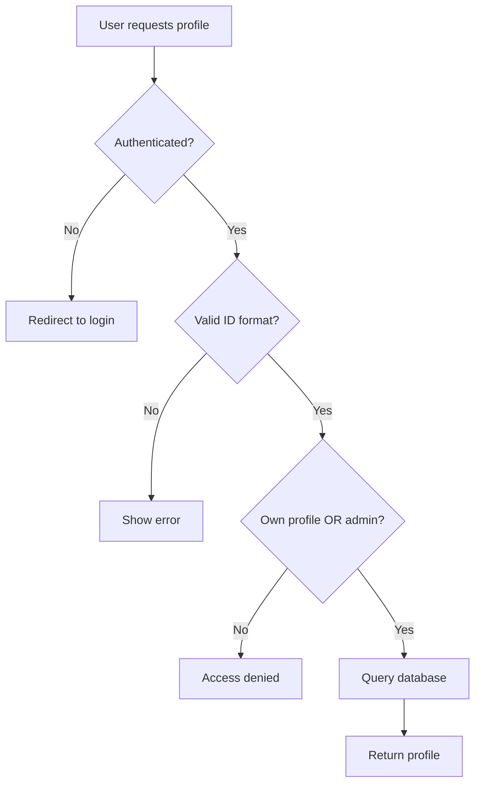

<Check>
  This code implements security best practices and protections against common web vulnerabilities.
</Check>

## Application Structure

The secure application demonstrates proper security controls and defensive programming.

### File Organization

```
secure/
├── app.py           # Hardened Flask application
├── database.py      # Secure database setup with hashed passwords
├── .env            # Environment variables for secrets
├── templates/       # Properly escaped HTML templates
└── users.db        # SQLite database
```

## Main Application (app.py)

### Imports and Security Modules

Source: `secure/app.py:1-8`

```python
from flask import Flask, render_template, request, redirect, session, flash
from markupsafe import escape
import sqlite3
from database import create_connection
from werkzeug.security import check_password_hash, generate_password_hash
from flask_wtf.csrf import CSRFProtect
import os
from dotenv import load_dotenv
```

<Info>
  **Security Libraries**:
  - `markupsafe.escape` - Prevents XSS attacks
  - `werkzeug.security` - Secure password hashing with bcrypt
  - `flask_wtf.csrf` - CSRF token protection
  - `dotenv` - Environment variable management
</Info>

### Configuration

Source: `secure/app.py:10-16`

```python
load_dotenv()

app = Flask(__name__)
app.secret_key = os.getenv('SECRET_KEY')

# Protección CSRF
csrf = CSRFProtect(app)
```

<Check>
  **Security Improvements**:
  - Secret key loaded from environment variables
  - Not hardcoded or in version control
  - CSRF protection enabled globally
  - Different keys per environment
</Check>

### Security Headers Middleware

Source: `secure/app.py:18-26`

```python
@app.after_request
def set_security_headers(response):
    response.headers['X-Content-Type-Options'] = 'nosniff'
    response.headers['X-Frame-Options'] = 'DENY'
    response.headers['X-XSS-Protection'] = '1; mode=block'
    response.headers['Strict-Transport-Security'] = 'max-age=31536000; includeSubDomains'
    response.headers['Content-Security-Policy'] = "default-src 'self'"
    return response
```

<Info>
  **HTTP Security Headers**:
  
  <ParamField path="X-Content-Type-Options" type="string" default="nosniff">
    Prevents MIME type sniffing attacks
  </ParamField>
  
  <ParamField path="X-Frame-Options" type="string" default="DENY">
    Prevents clickjacking attacks
  </ParamField>
  
  <ParamField path="X-XSS-Protection" type="string" default="1; mode=block">
    Enables browser's XSS filter
  </ParamField>
  
  <ParamField path="Strict-Transport-Security" type="string">
    Forces HTTPS connections for 1 year
  </ParamField>
  
  <ParamField path="Content-Security-Policy" type="string" default="default-src 'self'">
    Restricts resource loading to same origin
  </ParamField>
</Info>

### Route: Login (Secure Authentication)

Source: `secure/app.py:32-73`

<Tabs>
  <Tab title="Full Route">
    ```python
    @app.route('/login', methods=['GET', 'POST'])
    def login():
        if request.method == 'POST':
            username = request.form.get('username', '').strip()
            password = request.form.get('password', '')
            
            # Validación de entrada
            if not username or not password:
                flash('Usuario y contraseña son requeridos', 'danger')
                return render_template('login.html')
            
            if len(username) > 50:
                flash('Usuario inválido', 'danger')
                return render_template('login.html')
            
            connection = create_connection()
            if not connection:
                flash('Error de conexión a la base de datos', 'danger')
                return render_template('login.html')
            
            cursor = connection.cursor()
            
            # SEGURO: Prepared statement (previene SQL Injection)
            query = "SELECT * FROM users WHERE username = %s"
            cursor.execute(query, (username,))
            user = cursor.fetchone()
            
            cursor.close()
            connection.close()
            
            # SEGURO: Verificación de hash de contraseña
            if user and check_password_hash(user['password'], password):
                session['user_id'] = user['id']
                session['username'] = user['username']
                session['role'] = user['role']
                session.permanent = True
                flash('Login exitoso!', 'success')
                return redirect('/dashboard')
            else:
                flash('Credenciales incorrectas', 'danger')
        
        return render_template('login.html')
    ```
  </Tab>
  <Tab title="Key Security Features">
    ```python
    # Input validation
    username = request.form.get('username', '').strip()
    if not username or not password:
        return error
    if len(username) > 50:
        return error
    
    # Prepared statement prevents SQL injection
    query = "SELECT * FROM users WHERE username = %s"
    cursor.execute(query, (username,))
    
    # Secure password verification
    if user and check_password_hash(user['password'], password):
        # Login successful
    ```
  </Tab>
</Tabs>

<Check>
  **Security Controls**:
  
  1. **Input Validation** - Length and presence checks
  2. **Prepared Statements** - Parameterized queries prevent SQL injection
  3. **Password Hashing** - Bcrypt with automatic salt
  4. **Generic Error Messages** - "Credenciales incorrectas" doesn't reveal if username exists
  5. **No Debug Output** - No query logging or error details
  6. **Session Security** - Permanent sessions with secure configuration
</Check>

### Route: Register (Secure User Creation)

Source: `secure/app.py:75-122`

```python
@app.route('/register', methods=['GET', 'POST'])
def register():
    if request.method == 'POST':
        username = request.form.get('username', '').strip()
        password = request.form.get('password', '')
        email = request.form.get('email', '').strip()
        
        # Validaciones
        if not username or not password or not email:
            flash('Todos los campos son requeridos', 'danger')
            return render_template('register.html')
        
        if len(username) < 3 or len(username) > 50:
            flash('El usuario debe tener entre 3 y 50 caracteres', 'danger')
            return render_template('register.html')
        
        if len(password) < 6:
            flash('La contraseña debe tener al menos 6 caracteres', 'danger')
            return render_template('register.html')
        
        connection = create_connection()
        if not connection:
            flash('Error de conexión', 'danger')
            return render_template('register.html')
        
        cursor = connection.cursor()
        
        try:
            # SEGURO: Hash de contraseña con bcrypt
            hashed_password = generate_password_hash(password)
            
            # SEGURO: Prepared statement
            query = "INSERT INTO users (username, password, email) VALUES (%s, %s, %s)"
            cursor.execute(query, (username, hashed_password, email))
            
            connection.commit()
            flash('Usuario registrado exitosamente!', 'success')
            return redirect('/login')
        except sqlite3.IntegrityError:
            flash('El usuario ya existe', 'danger')
        except Exception as e:
            flash('Error al registrar usuario', 'danger')
            print(f"Error: {e}")
        finally:
            cursor.close()
            connection.close()
    
    return render_template('register.html')
```

<Check>
  **Security Features**:
  
  - **Comprehensive Input Validation**
    - Required field checks
    - Username length: 3-50 characters
    - Password minimum: 6 characters
    - Input trimming with `.strip()`
  
  - **Secure Password Storage**
    - Bcrypt hashing via `generate_password_hash()`
    - Automatic salt generation
    - Computational cost prevents brute force
  
  - **SQL Injection Prevention**
    - Parameterized queries
    - No string concatenation
  
  - **Error Handling**
    - Catches `IntegrityError` for duplicate usernames
    - Generic error messages to users
    - Detailed errors only logged server-side
</Check>

### Route: Dashboard (XSS Prevention)

Source: `secure/app.py:124-137`

```python
@app.route('/dashboard')
def dashboard():
    # SEGURO: Verificación de sesión
    if 'user_id' not in session:
        flash('Debes iniciar sesión', 'warning')
        return redirect('/login')
    
    # SEGURO: Escape de HTML (XSS prevention)
    message = request.args.get('message', '')
    
    return render_template('dashboard.html', 
                         username=session.get('username'),
                         message=escape(message),
                         role=session.get('role'))
```

<Check>
  **XSS Prevention**:
  - `escape()` function sanitizes all HTML special characters
  - `<script>` becomes `&lt;script&gt;` (harmless text)
  - Template uses `{{ message }}` without `|safe` filter
  - CSP headers provide additional layer of protection
</Check>

#### Before and After

<CodeGroup>
```python Vulnerable
message = request.args.get('message', '')
return render_template('dashboard.html', message=message)
# Template: {{ message|safe }}
```

```python Secure
from markupsafe import escape
message = escape(request.args.get('message', ''))
return render_template('dashboard.html', message=message)
# Template: {{ message }}
```
</CodeGroup>

### Route: Profile (IDOR Prevention)

Source: `secure/app.py:139-179`

```python
@app.route('/profile')
def profile():
    # SEGURO: Verificación de sesión
    if 'user_id' not in session:
        flash('Debes iniciar sesión', 'warning')
        return redirect('/login')
    
    # SEGURO: Validación de autorización (previene IDOR)
    requested_id = request.args.get('id', session['user_id'])
    
    try:
        requested_id = int(requested_id)
    except ValueError:
        flash('ID inválido', 'danger')
        return redirect('/dashboard')
    
    # Solo permitir ver el propio perfil (o admin puede ver todos)
    if requested_id != session['user_id'] and session.get('role') != 'admin':
        flash('No tienes permiso para ver este perfil', 'danger')
        return redirect('/dashboard')
    
    connection = create_connection()
    if not connection:
        flash('Error de conexión', 'danger')
        return redirect('/dashboard')
    
    cursor = connection.cursor()
    
    # SEGURO: Prepared statement + No se devuelve la contraseña
    query = "SELECT id, username, email, role, created_at FROM users WHERE id = %s"
    cursor.execute(query, (requested_id,))
    user = cursor.fetchone()
    
    cursor.close()
    connection.close()
    
    if not user:
        flash('Usuario no encontrado', 'danger')
        return redirect('/dashboard')
    
    return render_template('profile.html', user=user)
```

<Check>
  **Authorization Controls**:
  
  1. **Authentication Check** - Requires active session
  2. **Input Validation** - Type checking with `int()`
  3. **Authorization Logic**:
     - Users can only view their own profile
     - Admins can view any profile
     - Unauthorized access blocked with 403
  4. **Data Minimization** - Password field excluded from SELECT
  5. **SQL Injection Prevention** - Parameterized query
</Check>

#### Authorization Flow



## Database Module (database.py)

### Secure Database Setup

Source: `secure/database.py:17-52`

```python
def setup_database():
    conn = sqlite3.connect(get_db_path())
    cursor = conn.cursor()
    
    cursor.execute("""
        CREATE TABLE IF NOT EXISTS users (
            id INTEGER PRIMARY KEY AUTOINCREMENT,
            username TEXT NOT NULL UNIQUE,
            password TEXT NOT NULL,
            email TEXT,
            role TEXT DEFAULT 'user',
            created_at TIMESTAMP DEFAULT CURRENT_TIMESTAMP
        )
    """)
    
    # Performance optimization
    cursor.execute("CREATE INDEX IF NOT EXISTS idx_username ON users(username)")
    
    # SEGURO: Contraseñas hasheadas
    admin_password = generate_password_hash('admin123')
    user_password = generate_password_hash('password123')
    
    try:
        cursor.execute("""
            INSERT INTO users (username, password, email, role) 
            VALUES (?, ?, ?, ?)
        """, ('admin', admin_password, 'admin@test.com', 'admin'))
        
        cursor.execute("""
            INSERT INTO users (username, password, email) 
            VALUES (?, ?, ?)
        """, ('usuario', user_password, 'user@test.com'))
    except sqlite3.IntegrityError:
        pass
    
    conn.commit()
    conn.close()
```

<Check>
  **Database Security**:
  - **Hashed Passwords** - All passwords stored with bcrypt
  - **Indexes** - Performance optimization on username lookups
  - **Prepared Statements** - Even for setup queries
  - **Unique Constraints** - Prevents duplicate usernames
</Check>

### Password Hash Comparison

<CodeGroup>
```python Vulnerable Database
# Plaintext storage
INSERT INTO users VALUES ('admin', 'admin123', ...)

# Database contains:
# id | username | password   | email
# 1  | admin    | admin123   | admin@test.com
```

```python Secure Database
# Hashed storage
hashed = generate_password_hash('admin123')
INSERT INTO users VALUES ('admin', hashed, ...)

# Database contains:
# id | username | password                                                    | email
# 1  | admin    | scrypt:32768:8:1$h3k2j1$abc123...def456 (60+ chars)        | admin@test.com
```
</CodeGroup>

## Environment Configuration

### .env File Structure

```bash
# Secret key for Flask sessions (generate with secrets.token_hex(32))
SECRET_KEY=your-random-secret-key-here

# Database configuration
DATABASE_PATH=./users.db

# Session configuration
SESSION_COOKIE_SECURE=True
SESSION_COOKIE_HTTPONLY=True
SESSION_COOKIE_SAMESITE=Lax

# CSRF configuration
WTF_CSRF_ENABLED=True
```

<Warning>
  Never commit `.env` to version control. Add it to `.gitignore`:
  ```bash
  echo ".env" >> .gitignore
  ```
</Warning>

### Generating a Secure Secret Key

```python
import secrets
print(secrets.token_hex(32))
# Output: 'a1b2c3d4e5f6...'
```

## Security Best Practices Implemented

<AccordionGroup>
  <Accordion title="SQL Injection Prevention" icon="shield">
    **Technique**: Parameterized queries (prepared statements)
    
    ```python
    # Always use parameterized queries
    cursor.execute("SELECT * FROM users WHERE username = %s", (username,))
    
    # NEVER use string formatting
    # cursor.execute(f"SELECT * FROM users WHERE username = '{username}'")  # ❌
    ```
    
    **How it works**: The database driver separates SQL code from data, preventing injection.
  </Accordion>
  
  <Accordion title="XSS Prevention" icon="code">
    **Techniques**:
    1. **HTML Escaping**: `escape()` function converts special characters
    2. **CSP Headers**: Restricts inline scripts and external resources
    3. **Proper Template Usage**: Avoid `|safe` filter unless absolutely necessary
    
    ```python
    from markupsafe import escape
    safe_output = escape(user_input)
    ```
  </Accordion>
  
  <Accordion title="Authentication Security" icon="key">
    **Password Security**:
    - **Hashing Algorithm**: Bcrypt via Werkzeug
    - **Automatic Salt**: Each password gets unique salt
    - **Computational Cost**: Tunable work factor prevents brute force
    
    ```python
    # Hashing
    hashed = generate_password_hash(password)
    
    # Verification
    is_valid = check_password_hash(stored_hash, password)
    ```
  </Accordion>
  
  <Accordion title="Authorization Controls" icon="lock">
    **Access Control Pattern**:
    
    ```python
    # 1. Authentication
    if 'user_id' not in session:
        return redirect('/login')
    
    # 2. Input validation
    try:
        resource_id = int(request.args.get('id'))
    except ValueError:
        return error
    
    # 3. Authorization
    if resource_id != session['user_id'] and session['role'] != 'admin':
        return forbidden
    ```
  </Accordion>
  
  <Accordion title="CSRF Protection" icon="shield-check">
    **Implementation**: Flask-WTF CSRFProtect
    
    ```python
    from flask_wtf.csrf import CSRFProtect
    csrf = CSRFProtect(app)
    ```
    
    **In templates**:
    ```html
    <form method="POST">
        {{ csrf_token() }}
        <!-- form fields -->
    </form>
    ```
  </Accordion>
  
  <Accordion title="Security Headers" icon="browser">
    **Headers Applied**:
    
    | Header | Purpose | Value |
    |--------|---------|-------|
    | `X-Content-Type-Options` | Prevent MIME sniffing | `nosniff` |
    | `X-Frame-Options` | Prevent clickjacking | `DENY` |
    | `X-XSS-Protection` | Enable XSS filter | `1; mode=block` |
    | `Strict-Transport-Security` | Force HTTPS | `max-age=31536000` |
    | `Content-Security-Policy` | Control resources | `default-src 'self'` |
  </Accordion>
</AccordionGroup>

## Testing Security Controls

<Steps>
  <Step title="Test SQL Injection Protection">
    Try the previous SQL injection attack:
    ```bash
    Username: admin' OR '1'='1
    Password: anything
    ```
    
    **Expected Result**: Login fails with "Credenciales incorrectas"
    
    The prepared statement treats the entire input as a string, not SQL code.
  </Step>
  
  <Step title="Test XSS Protection">
    Visit:
    ```
    http://localhost:5001/dashboard?message=<script>alert('XSS')</script>
    ```
    
    **Expected Result**: The literal text `<script>alert('XSS')</script>` appears on the page (not executed)
  </Step>
  
  <Step title="Test IDOR Protection">
    Login as regular user, then try to view admin profile:
    ```
    http://localhost:5001/profile?id=1
    ```
    
    **Expected Result**: "No tienes permiso para ver este perfil" message
  </Step>
  
  <Step title="Test Password Hashing">
    Check the database:
    ```bash
    sqlite3 users.db "SELECT username, password FROM users"
    ```
    
    **Expected Result**: Passwords are long hashed strings starting with `scrypt:` or `pbkdf2:`
  </Step>
</Steps>

## Performance Considerations

<Note>
  **Password Hashing Impact**: Bcrypt is intentionally slow (computational cost) to prevent brute force attacks. This adds ~100-300ms to login/register operations, which is acceptable for the security benefit.
</Note>

### Database Indexes

```python
cursor.execute("CREATE INDEX IF NOT EXISTS idx_username ON users(username)")
```

Index on `username` column speeds up login queries significantly:
- Without index: O(n) full table scan
- With index: O(log n) B-tree lookup

## Security Checklist

<Check>SQL Injection - Parameterized queries everywhere</Check>
<Check>XSS - HTML escaping and CSP headers</Check>
<Check>CSRF - Token validation on forms</Check>
<Check>Authentication - Bcrypt password hashing</Check>
<Check>Authorization - Role-based access control</Check>
<Check>IDOR - User ID validation and permission checks</Check>
<Check>Security Headers - X-Frame-Options, CSP, HSTS</Check>
<Check>Secret Management - Environment variables</Check>
<Check>Error Handling - Generic messages to users</Check>
<Check>Input Validation - Type and length checks</Check>

<Info>
  For production deployments, also consider:
  - Rate limiting (prevent brute force)
  - HTTPS enforcement (TLS/SSL)
  - Database encryption at rest
  - Audit logging
  - Regular security updates
  - Penetration testing
</Info>